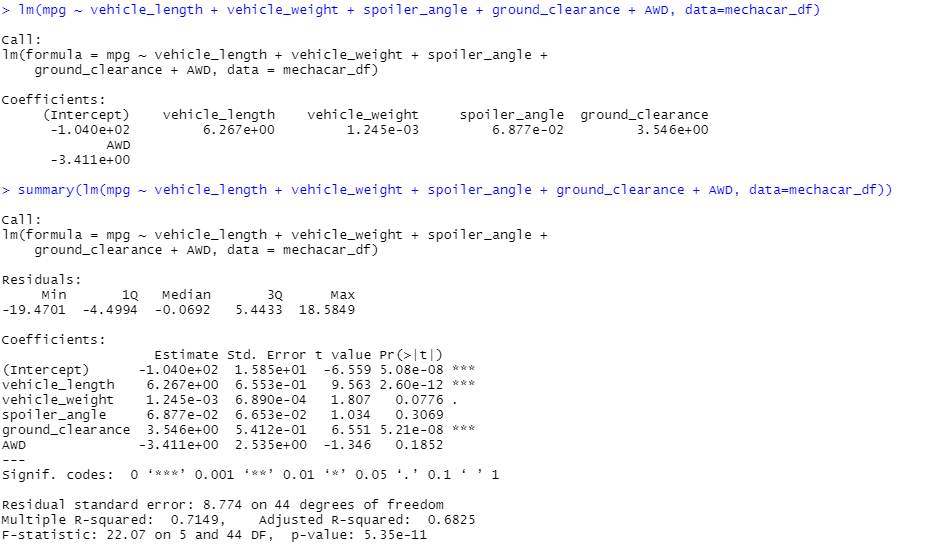
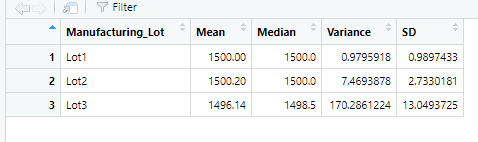
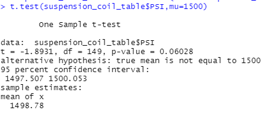
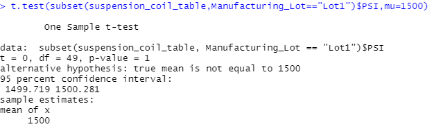
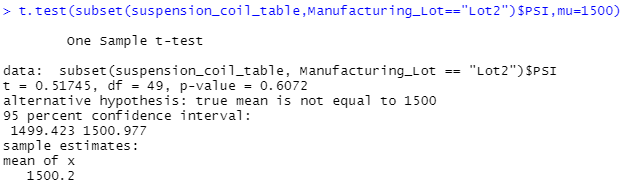
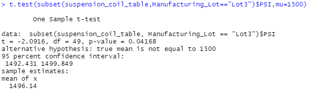

# MechaCar_Stats_Analysis 
## Linear Regression to Predict MPG

### Which variables/coefficients provided a non-random amount of variance to the mpg values in the dataset?
* Vehicle length has a p value that is less than the .05 which can conclude it is a non-random variance.
### Is the slope of the linear model considered to be zero? Why or why not?
* No, due to the fact that the p-value for the model is 5.35e -11. This as you can infer is much lower than the 0.05. Therefore, we can reject the null hypothesis with a slope that is not zero. 
### Does this linear model predict mpg of MechaCar prototypes effectively? Why or why not?
* Yes, the r-squared of the model is above 0.70 @ 0.7149 and a strong p-value.

## Summary Statistics on Suspension Coils 
* The design specifications for the MechaCar suspension coils dictate that the variance of the suspension coils must not exceed 100 pounds per square inch. Does the current manufacturing data meet this design specification for all manufacturing lots in total and each lot individually? Why or why not?

    * When looking at the data in aggregate, the design specs are being met with a variance of 62.3, however, when breaking down each sector, Lot 3 exceeds the needed specifications at 170.3 PSI.

## T- Tests on Suspension Coils 
### Below is a quick recap of the t-test's for the suspension data.

* A p=value of .06 is within reason of the .05 significance level, meaning the data popluation is statistical similar. 

* The p-value was equal to 1 in the lot 1 data set. This makes the data similar. 

* Similar to lot 1, the p-value was 0.61. this makes the data statistically similar. 

* Lot 3 was the only test to have a p-value below the significance level of 0.05 @ 0.04. This makes the data not statistically similar. 

## Study Design: MecharCar vs Competition 

The metric or metrics that will be tested:
* Pricing between various dealerships
* Carbon/EV abiilty vs competition 
* Miles Per Gallon (MPG): City vs Highway
* Maintenance/Upkeep Cost

The null hypothesis would be: 
* There is no statistically difference in the data between MechaCar and competitors

Potential analysis to use to test our hypothesis: 
* Linear Regression:
    * Robust when looking at independent variables across one another. Examples of data used would be:
         * Data across various dealers
         * Carbon and EV foot prints. 
         * Miles per gallon across city and highway 
         
